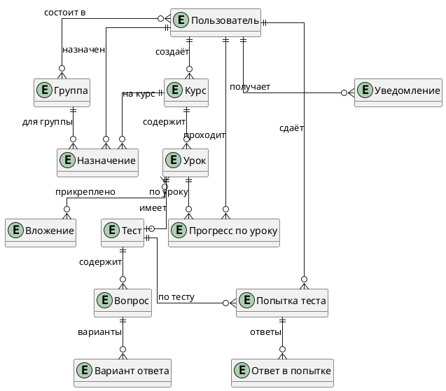
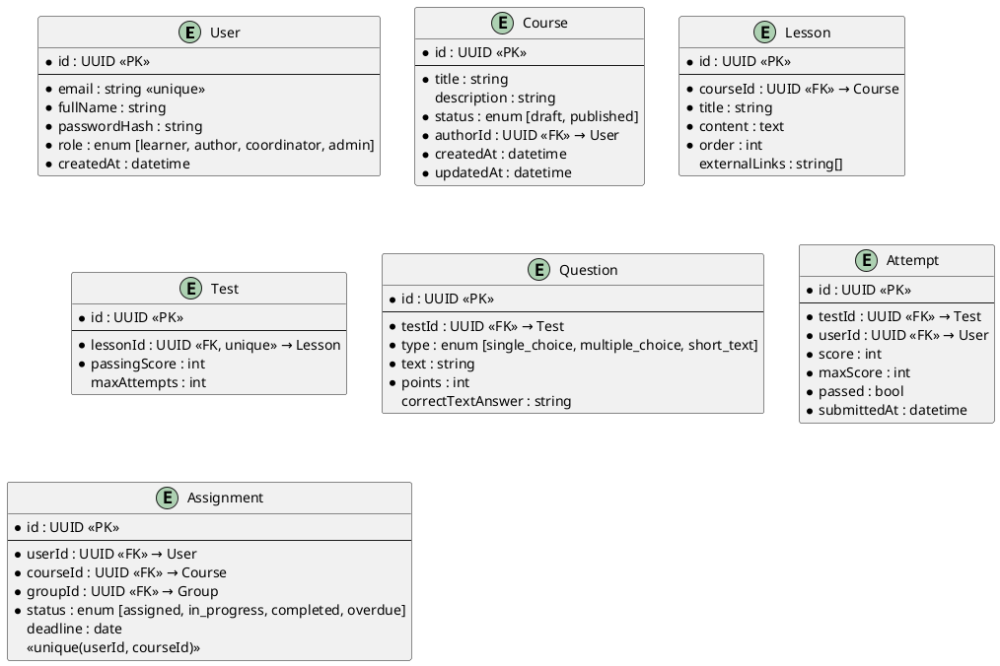

# Модель данных (ERD) — MiniLMS

13 сущностей + 2 промежуточные таблицы для связей M:N.

## Концептуальная модель

Только сущности и связи, без атрибутов.

## Логическая модель (ключевые сущности)

## Обоснование решений

- **PostgreSQL** — данных < 200 МБ/год, связи через FK, нужен ACID
- **UUID** — для идемпотентности (генерация ID на клиенте)
- **Lesson → Test: 1:0..1** — FK на стороне Test, чтобы избежать циклической зависимости
- **Вложения: M:N** через `lesson_attachments` (один файл может быть в нескольких уроках)
- **Enum через VARCHAR + CHECK** — проще при миграциях
- **Попытки без CASCADE** — неизменяемы по NFR-DATA-02
