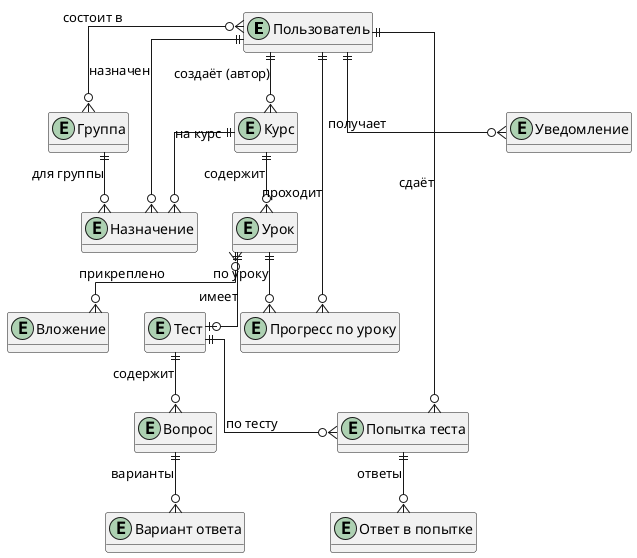

# Модель данных (ERD)

Модель спроектирована на основе функциональных требований (UC-01…UC-09) и OpenAPI-спецификации. Всего 13 сущностей + 2 промежуточные таблицы для связей M:N.

## Концептуальная модель

Только сущности и связи, без атрибутов.

## Логическая модель

Атрибуты с типами, PK/FK, промежуточные таблицы.

### User

| Поле | Тип | Ограничения |
|------|-----|-------------|
| id | UUID | PK |
| email | string | unique |
| fullName | string | not null |
| passwordHash | string | not null |
| role | enum | learner / author / coordinator / admin |
| createdAt | datetime | not null |

### Group

| Поле | Тип | Ограничения |
|------|-----|-------------|
| id | UUID | PK |
| name | string | not null |
| memberCount | int | — |

### GroupMember (M:N)

| Поле | Тип | Ограничения |
|------|-----|-------------|
| groupId | UUID | PK, FK → Group |
| userId | UUID | PK, FK → User |

### Course

| Поле | Тип | Ограничения |
|------|-----|-------------|
| id | UUID | PK |
| title | string | not null |
| description | string | — |
| status | enum | draft / published |
| authorId | UUID | FK → User |
| createdAt | datetime | not null |
| updatedAt | datetime | not null |

### Lesson

| Поле | Тип | Ограничения |
|------|-----|-------------|
| id | UUID | PK |
| courseId | UUID | FK → Course |
| title | string | not null |
| content | text | — |
| order | int | not null |
| externalLinks | string[] | — |

### Attachment

| Поле | Тип | Ограничения |
|------|-----|-------------|
| id | UUID | PK |
| fileName | string | not null |
| url | string | not null |
| sizeBytes | int | not null |
| mimeType | string | — |

### LessonAttachment (M:N)

| Поле | Тип | Ограничения |
|------|-----|-------------|
| lessonId | UUID | PK, FK → Lesson |
| attachmentId | UUID | PK, FK → Attachment |

### Test

| Поле | Тип | Ограничения |
|------|-----|-------------|
| id | UUID | PK |
| lessonId | UUID | FK → Lesson, unique |
| passingScore | int | not null |
| maxAttempts | int | nullable |

### Question

| Поле | Тип | Ограничения |
|------|-----|-------------|
| id | UUID | PK |
| testId | UUID | FK → Test |
| type | enum | single_choice / multiple_choice / short_text |
| text | string | not null |
| points | int | not null |
| correctTextAnswer | string | nullable (для short_text) |

### Option

| Поле | Тип | Ограничения |
|------|-----|-------------|
| id | UUID | PK |
| questionId | UUID | FK → Question |
| text | string | not null |
| isCorrect | bool | not null |

### Attempt

| Поле | Тип | Ограничения |
|------|-----|-------------|
| id | UUID | PK |
| testId | UUID | FK → Test |
| userId | UUID | FK → User |
| score | int | not null |
| maxScore | int | not null |
| passed | bool | not null |
| submittedAt | datetime | not null, неизменяема (NFR-DATA-02) |

### AttemptAnswer

| Поле | Тип | Ограничения |
|------|-----|-------------|
| id | UUID | PK |
| attemptId | UUID | FK → Attempt |
| questionId | UUID | FK → Question |
| selectedOptionIds | UUID[] | для choice-вопросов |
| textAnswer | string | для short_text |

### Assignment

| Поле | Тип | Ограничения |
|------|-----|-------------|
| id | UUID | PK |
| userId | UUID | FK → User |
| courseId | UUID | FK → Course |
| groupId | UUID | FK → Group, nullable |
| status | enum | assigned / in_progress / completed / overdue |
| startDate | date | nullable |
| deadline | date | nullable |
| completedAt | datetime | nullable |

### LessonProgress

| Поле | Тип | Ограничения |
|------|-----|-------------|
| id | UUID | PK |
| userId | UUID | FK → User |
| lessonId | UUID | FK → Lesson |
| completedAt | datetime | not null |

### Notification

| Поле | Тип | Ограничения |
|------|-----|-------------|
| id | UUID | PK |
| userId | UUID | FK → User |
| type | enum | assignment / deadline_reminder / overdue |
| title | string | not null |
| message | string | — |
| read | bool | default false |
| createdAt | datetime | not null |
