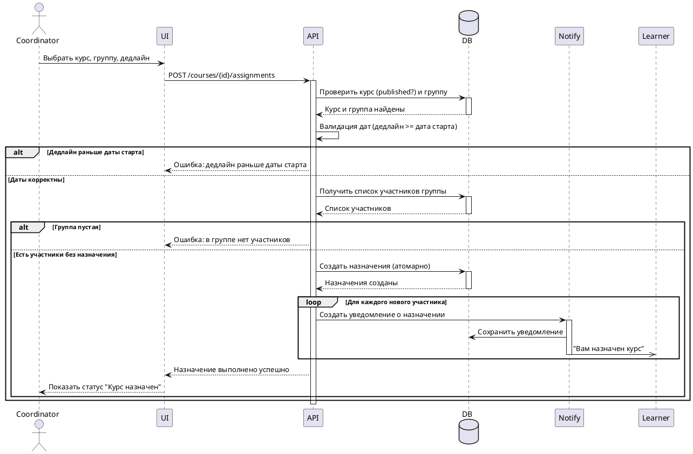
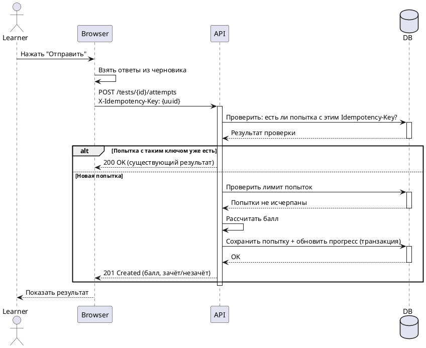

# Sequence-диаграммы — MiniLMS

## UC-06 — Назначение курса группе

```plantuml
@startuml
actor Coordinator
participant UI
participant API
database DB
participant Notify

Coordinator -> UI: Выбрать курс, группу, дедлайн
UI -> API: POST /courses/{id}/assignments
activate API

API -> DB: Проверить курс (published?) и группу
activate DB
DB --> API: Курс и группа найдены
deactivate DB

API -> API: Валидация дат (дедлайн >= дата старта)

alt Дедлайн раньше даты старта
    API --> UI: Ошибка: дедлайн раньше даты старта
else Даты корректны
    API -> DB: Получить список участников группы
    activate DB
    DB --> API: Список участников
    deactivate DB

    alt Группа пустая
        API --> UI: Ошибка: в группе нет участников
    else Есть участники без назначения
        API -> DB: Создать назначения (атомарно)
        activate DB
        DB --> API: Назначения созданы
        deactivate DB

        loop Для каждого нового участника
            API -> Notify: Создать уведомление о назначении
            activate Notify
            Notify -> DB: Сохранить уведомление
            Notify ->> Learner: "Вам назначен курс"
            deactivate Notify
        end

        API --> UI: Назначение выполнено успешно
        UI --> Coordinator: Показать статус "Курс назначен"
    end
end

deactivate API
@enduml
```

## UC-07 — Отправка попытки теста (с идемпотентностью)

```plantuml
@startuml
actor Learner
participant Browser
participant API
database DB

Learner -> Browser: Нажать "Отправить"
Browser -> Browser: Взять ответы из черновика

Browser -> API: POST /tests/{id}/attempts\nX-Idempotency-Key: {uuid}
activate API

API -> DB: Проверить: есть ли попытка с этим Idempotency-Key?
activate DB
DB --> API: Результат проверки
deactivate DB

alt Попытка с таким ключом уже есть
    API --> Browser: 200 OK (существующий результат)
else Новая попытка
    API -> DB: Проверить лимит попыток
    activate DB
    DB --> API: Попытки не исчерпаны
    deactivate DB

    API -> API: Рассчитать балл
    API -> DB: Сохранить попытку + обновить прогресс (транзакция)
    activate DB
    DB --> API: OK
    deactivate DB

    API --> Browser: 201 Created (балл, зачёт/незачёт)
end

deactivate API
Browser --> Learner: Показать результат
@enduml
```
