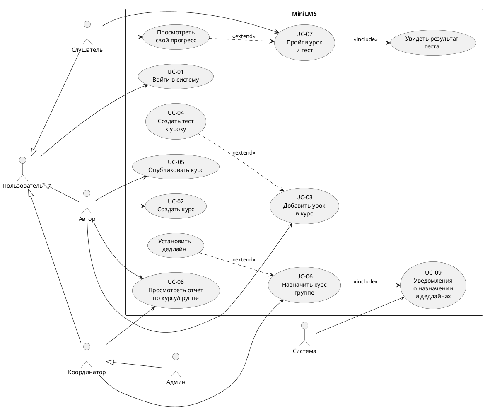

# Use Case — Диаграмма прецедентов

## Диаграмма

## Описание связей

| Связь | Тип | Пояснение |
|-------|-----|-----------|
| UC-07 → Результат теста | include | Прохождение теста всегда показывает результат |
| UC-06 → UC-09 | include | Назначение курса всегда создаёт уведомление |
| Дедлайн → UC-06 | extend | Установка дедлайна — опциональная часть назначения |
| UC-04 → UC-03 | extend | Тест добавляется к уроку (не обязательно) |
| Прогресс → UC-07 | extend | Просмотр прогресса — опциональная часть прохождения |
